# 🛒 Django E-commerce Project

A full-featured **Django-based E-commerce web application** with modern UI, secure authentication, cart & checkout flow, coupon management, and payment integration. This project is designed to be modular, scalable, and production-ready.

---

## 🚀 Features

### 👤 User Features

* User registration, login, logout (session-based authentication)
* User profile & address management
* Product browsing with categories
* Product details with images
* Add to cart / update quantity / remove items (AJAX-powered)
* Apply & remove coupon codes
* Checkout with order summary
* Secure payment initiation flow
* Order history & order details

### 🛍️ Cart & Checkout

* Persistent cart (user-based)
* Real-time quantity update
* Coupon validation & discount calculation
* Tax & total price calculation
* Order creation before payment
* Payment status tracking

### 🧑‍💼 Admin Features

* Product management (CRUD)
* Category management
* Coupon management (expiry, usage limits)
* Order & payment monitoring
* User management via Django Admin
* User activity tracking and analytics


---

## 🛠️ Tech Stack

* **Backend:** Django, Python
* **Frontend:** HTML5, CSS3, Bootstrap 5, JavaScript (AJAX)
* **Database:** SQLite (default), PostgreSQL-ready
* **Authentication:** Django Auth
* **Payments:** Custom payment flow (extendable for gateways)
* **Static Files:** Django Static Files

---

## 📁 Project Structure

```
Django_ecommerce/
│
├── accounts/        # User authentication & profiles
├── products/        # Products & categories
├── orders/          # Cart, Orders, checkout, Coupon system & Payment handling
├── templates/       # HTML templates
├── static/          # CSS, JS, images
├── media/           # User-uploaded files (images)
├── .env             # Environment variables
├── manage.py
├── db.sqlite3
└── requirements.txt
```

---

## ⚙️ Installation & Setup

### 1️⃣ Clone the Repository

```bash
git clone https://github.com/DeveloperMamunur/Django_ecommerce_project.git
cd django-ecommerce
```

### 2️⃣ Create Virtual Environment

```bash
python -m venv venv
venv\Scripts\activate  # Windows
source venv/bin/activate  # Linux/Mac
```

### 3️⃣ Install Dependencies

```bash
pip install -r requirements.txt
```

### 4️⃣ Run Migrations

```bash
python manage.py makemigrations
python manage.py migrate
```

### 5️⃣ Create Superuser

```bash
python manage.py createsuperuser
```

### 6️⃣ Run Development Server

```bash
python manage.py runserver
```

Visit 👉 `http://127.0.0.1:8000/`

---

## 🔐 Environment Variables (Optional)

Create a `.env` file for sensitive data:

```
SECRET_KEY=your_secret_key
DEBUG=True
DATABASE_URL=...
```

---

## 🧪 Testing

```bash
python manage.py test
```

---

## 📸 Screenshots
Here are some screenshots of the application in action:

<table>
	<tr>
		<td>
			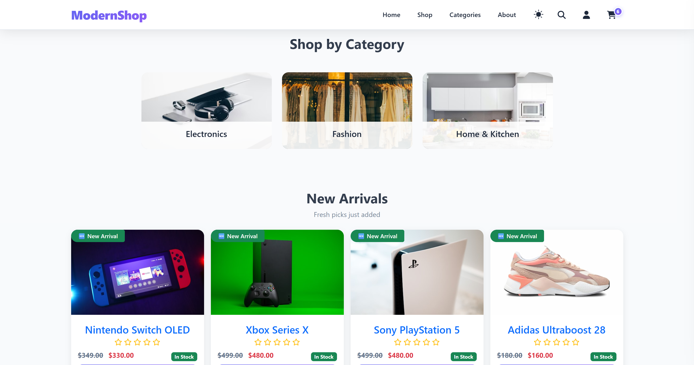
		</td>
		<td>
			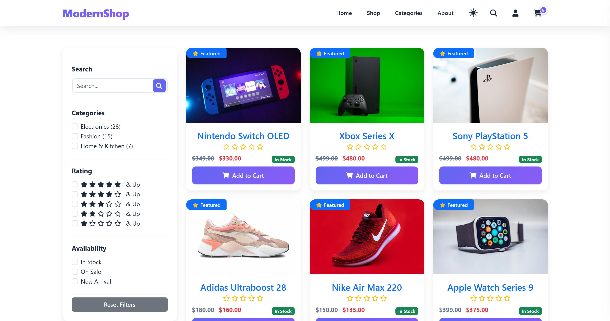
		</td>
	</tr>
	<tr>
		<td>
			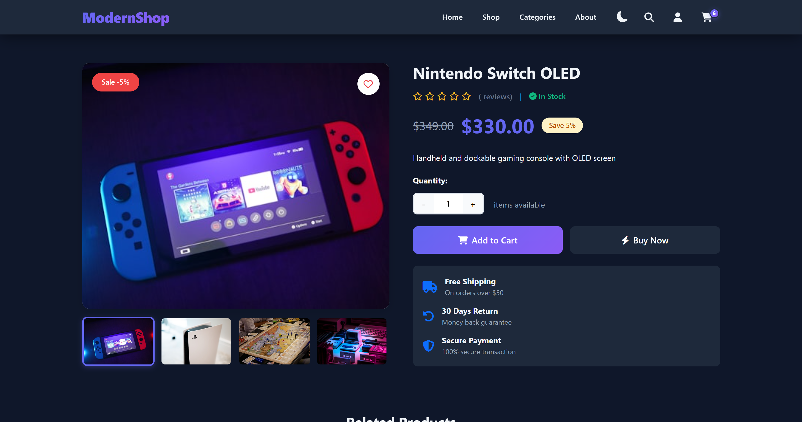
		</td>
		<td>
			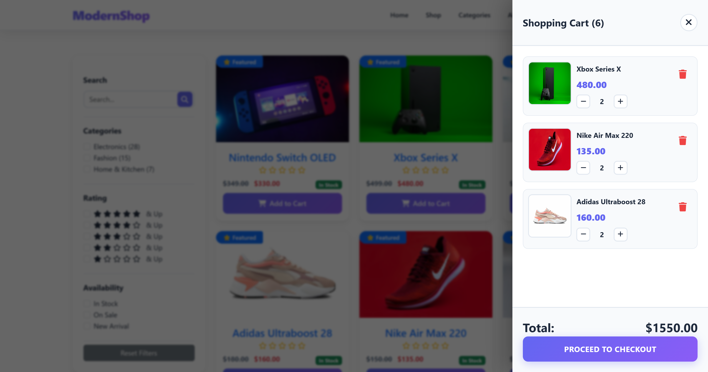
		</td>
	</tr>
	<tr>
		<td>
			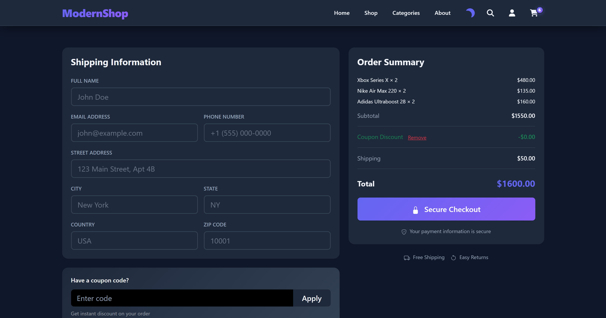
		</td>
		<td>
			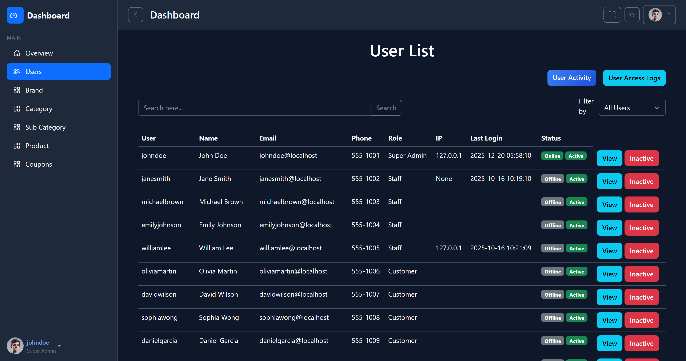
		</td>
	</tr>
	<tr>
		<td>
			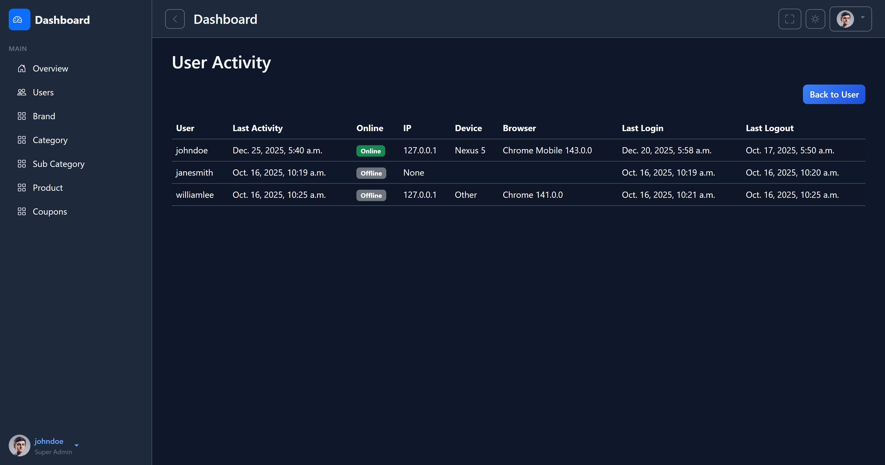
		</td>
		<td>
			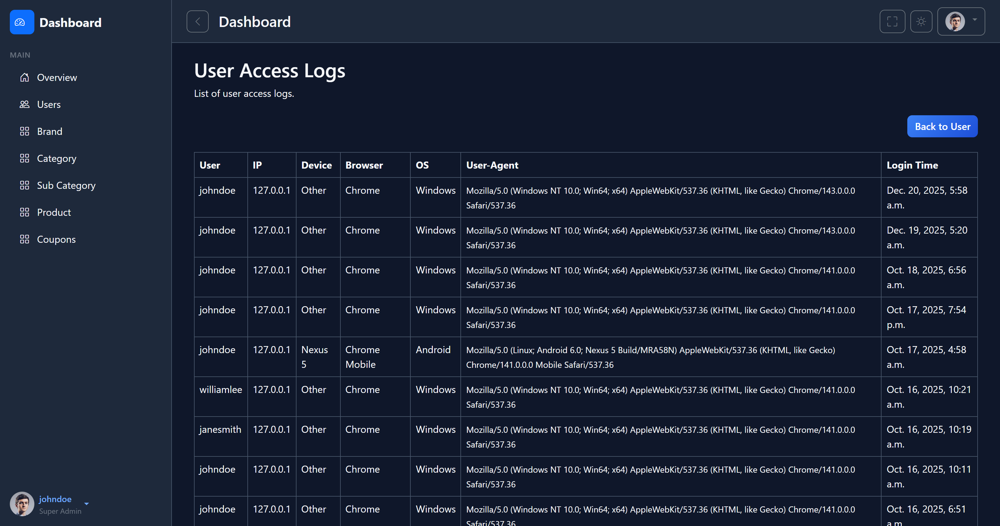
		</td>
	</tr>
	<tr>
		<td>
			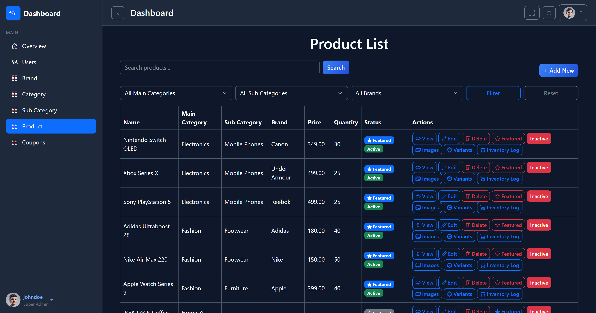
		</td>
		<td>
			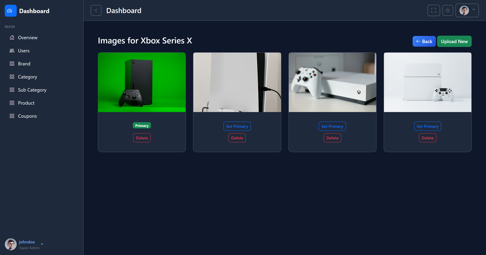
		</td>
	</tr>
	<tr>
		<td>
			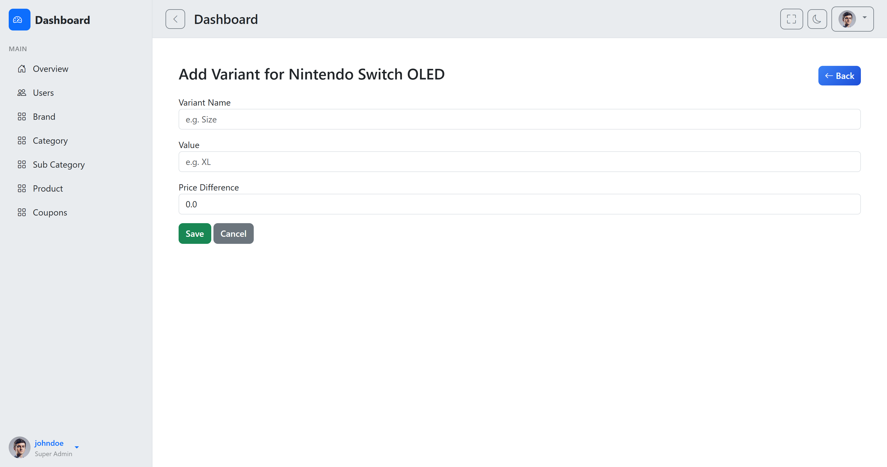
		</td>
		<td>
			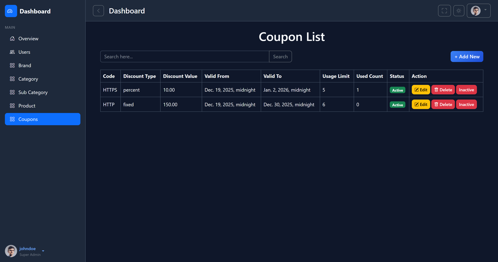
		</td>
	</tr>
</table>

---

## 🧩 Future Improvements

* Payment gateway integration (Stripe / SSLCommerz / PayPal)
* Product reviews & ratings
* Wishlist feature
* Email notifications
* REST API (Django REST Framework)
* React / Vue frontend

---

## 🤝 Contributing

Contributions are welcome!

1. Fork the repository
2. Create a new branch
3. Commit your changes
4. Open a Pull Request

---

## 📄 License

This project is licensed under the **MIT License**.

---

## 👨‍💻 Author

**Md. Mamunur Rashid**\
Full Stack Developer

---

⭐ If you like this project, give it a star!
